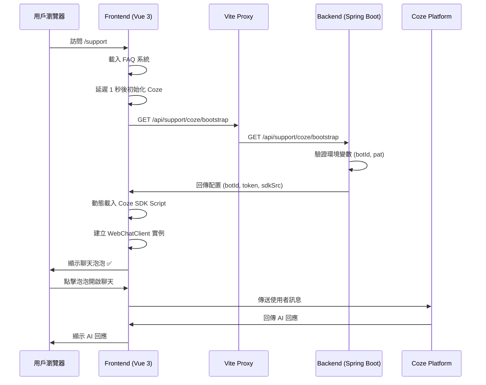

# Coze Web Chat SDK 整合指南

## 📚 文件索引

| 文件名稱 | 用途 | 適用對象 |
|---------|------|---------|
| [COZE_SETUP.md](COZE_SETUP.md) | 完整設定指南 | **首次設定必讀** |
| [COZE_TESTING_GUIDE.md](COZE_TESTING_GUIDE.md) | 測試流程與檢查清單 | 測試人員、開發者 |
| [COZE_TROUBLESHOOTING.md](COZE_TROUBLESHOOTING.md) | 疑難排解指南 | 遇到問題時查閱 |
| [diagnose-coze.ps1](../diagnose-coze.ps1) | 自動診斷腳本 | 快速檢查配置 |
| [setup-coze.ps1](../setup-coze.ps1) | 快速設定腳本 | 快速設定環境變數 |

---

## 🚀 5 分鐘快速開始

### Step 1：設定環境變數（3 分鐘）

#### 方式 1：使用快速設定腳本（推薦）
```powershell
# 在專案根目錄執行
.\setup-coze.ps1
```

腳本會自動：
1. 詢問並設定環境變數
2. 驗證後端 API
3. 產生可重複使用的設定檔 `coze-env.ps1`

#### 方式 2：手動設定
```powershell
# Windows PowerShell
$env:COZE_BOT_ID="你的Bot ID"
$env:COZE_PAT="你的Personal Access Token"
$env:COZE_CHAT_SDK_SRC="https://lf-cdn.coze.cn/obj/unpkg/flow-platform/chat-app-sdk/1.0.0-beta.4/libs/oversea/index.js"
```

---

### Step 2：啟動服務（2 分鐘）

#### 終端機 1：啟動後端
```bash
cd backend
mvn spring-boot:run
```

#### 終端機 2：啟動前端
```bash
cd frontend
npm run dev
```

---

### Step 3：驗證整合（1 分鐘）

1. 開啟瀏覽器：`http://localhost:5173/support`
2. 開啟 Chrome DevTools（F12）
3. 檢查 Console 是否顯示：

```
[Coze] 開始載入 Bootstrap 配置...
[Coze] Bootstrap 配置載入成功
[Coze] SDK 載入成功
[Coze] 初始化完成 ✅
```

4. 檢查頁面右下角是否出現 Coze 聊天泡泡

✅ **成功！** 如果看到泡泡，整合完成！

❌ **失敗？** 執行診斷腳本：
```powershell
.\diagnose-coze.ps1
```

---

## 📁 專案結構

### Backend（後端）
```
backend/
├── src/main/
│   ├── java/com/example/backend/
│   │   ├── controller/
│   │   │   └── support/
│   │   │       └── SupportCozeController.java      📌 Bootstrap API
│   │   ├── dto/
│   │   │   └── support/
│   │   │       └── CozeBootstrapResponseDto.java  📌 Response DTO
│   │   └── exception/
│   │       └── GlobalExceptionHandler.java        📌 404 處理
│   └── resources/
│       └── application.yml                        📌 Coze 配置
```

**關鍵端點**：
- `GET /api/support/coze/bootstrap` - 提供前端初始化所需配置

---

### Frontend（前端）
```
frontend/
├── .env                                           📌 SDK 來源 fallback
├── vite.config.js                                📌 Proxy 配置
├── src/
│   ├── api/
│   │   ├── http.js                               📌 Axios baseURL: '/api'
│   │   └── modules/
│   │       └── support.js                        📌 Bootstrap API 呼叫
│   ├── data/
│   │   └── supportFaq.js                         📌 FAQ 資料（14 項）
│   ├── views/
│   │   └── support/
│   │       ├── SupportCenterView.vue             📌 FAQ + Coze 初始化
│   │       └── SupportReportView.vue             📌 問題回報表單
│   ├── layouts/
│   │   └── MainLayout.vue                        📌 客服入口（側邊欄）
│   └── router/
│       └── index.js                              📌 /support, /support/report
└── docs/
    ├── COZE_SETUP.md                             📌 完整設定指南
    ├── COZE_TESTING_GUIDE.md                     📌 測試指南
    └── COZE_TROUBLESHOOTING.md                   📌 疑難排解
```

**關鍵頁面**：
- `/support` - 客服支援中心（FAQ + Coze 泡泡）
- `/support/report` - 問題回報表單

---

## 🔑 環境變數說明

| 變數名稱 | 必填 | 說明 | 取得方式 |
|---------|------|------|---------|
| `COZE_BOT_ID` | ✅ 必填 | Coze Bot 的唯一識別碼 | [Coze 平台](https://www.coze.com/) → Bot 設定 |
| `COZE_PAT` | ✅ 必填 | Personal Access Token | Coze 平台 → Personal Settings → Access Tokens |
| `COZE_CHAT_SDK_SRC` | ⚠️ 選填 | Web Chat SDK 來源 URL | 預設使用官方 CDN，通常不需更改 |

**重要提醒**：
- ⚠️ PAT Token 只能在建立時看到一次，請妥善保存
- ⚠️ Token 有過期時間，過期後需重新建立
- ⚠️ 不要將 Token 提交到版控系統（已加入 .gitignore）

---

## 🎯 功能特色

### 1. FAQ 系統
- ✅ 14 個常見問題（4 大分類）
- ✅ 關鍵字搜尋（標題、內容、標籤）
- ✅ 分類篩選
- ✅ 手風琴展開/收合
- ✅ 響應式設計

### 2. Coze AI 客服
- ✅ 智能聊天泡泡（右下角）
- ✅ 自動初始化（頁面載入後 1 秒）
- ✅ 會員 ID 辨識（member_{memId} / 匿名訪客）
- ✅ Token 自動刷新機制
- ✅ 錯誤處理（不影響 FAQ 功能）
- ✅ 防止重複初始化

### 3. 問題回報
- ✅ 結構化表單（問題類型、描述、圖片上傳）
- ✅ 圖片預覽與刪除
- ✅ 表單驗證
- ✅ 完善的錯誤處理

---

## 🔄 資料流程



---

## 🛠️ 常用指令

### 快速診斷
```powershell
# 檢查所有配置
.\diagnose-coze.ps1
```

### 快速設定
```powershell
# 設定環境變數（互動式）
.\setup-coze.ps1

# 設定環境變數（命令列參數）
.\setup-coze.ps1 -BotId "你的Bot ID" -Pat "你的PAT Token"
```

### 啟動服務
```bash
# 後端
cd backend && mvn spring-boot:run

# 前端
cd frontend && npm run dev
```

### 測試 API
```bash
# 測試 Bootstrap API
curl http://localhost:8080/api/support/coze/bootstrap
```

---

## 📊 檢查清單

### 首次設定
- [ ] 已取得 Coze Bot ID
- [ ] 已取得 Coze PAT Token
- [ ] 已設定環境變數（`setup-coze.ps1` 或手動）
- [ ] 後端啟動無錯誤
- [ ] 前端啟動無錯誤
- [ ] Bootstrap API 回傳 200 OK
- [ ] `/support` 頁面顯示 FAQ
- [ ] Coze 泡泡出現在右下角

### 日常維護
- [ ] 定期檢查 Token 是否過期
- [ ] 監控 Bootstrap API 呼叫頻率
- [ ] 檢查使用者回饋
- [ ] 更新 FAQ 內容

### 疑難排解
- [ ] 執行診斷腳本：`.\diagnose-coze.ps1`
- [ ] 檢查 Chrome DevTools Console
- [ ] 檢查 Chrome DevTools Network Tab
- [ ] 檢查後端 log
- [ ] 參考 [COZE_TROUBLESHOOTING.md](COZE_TROUBLESHOOTING.md)

---

## 🔒 安全性

### 後端保護
- ✅ 敏感資訊來自環境變數（不寫死在程式碼）
- ✅ Token 不在 log 印出完整內容
- ✅ DTO 的 `toString()` 自動遮蔽 Token
- ✅ 缺少配置時回傳明確錯誤訊息

### 前端保護
- ✅ Token 不在 Console 印出
- ✅ 錯誤處理不洩漏敏感資訊
- ✅ 匿名訪客使用 UUID（不重複）
- ✅ 會員使用 `member_{memId}`（辨識度高）

---

## 📞 支援資源

### 官方文件
- [Coze 平台](https://www.coze.com/)
- [Coze Web Chat SDK 文件](https://www.coze.com/docs/developer_guides/web_chat_sdk)

### 專案文件
- [完整設定指南](COZE_SETUP.md)
- [測試指南](COZE_TESTING_GUIDE.md)
- [疑難排解](COZE_TROUBLESHOOTING.md)

### 聯絡資訊
- 開發團隊：Take@Seat 開發團隊
- 最後更新：2026-01-31

---

## 📝 更新日誌

### 2026-01-31
- ✅ 完成 Coze Web Chat SDK 整合
- ✅ 實作 FAQ 系統（14 個問題，4 大分類）
- ✅ 實作問題回報表單
- ✅ 建立完整測試與診斷工具
- ✅ 新增 MainLayout 客服入口

---

**維護者**：Take@Seat 開發團隊  
**最後更新**：2026-01-31
